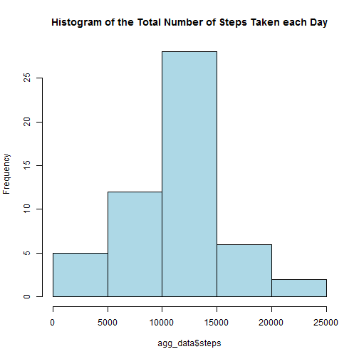
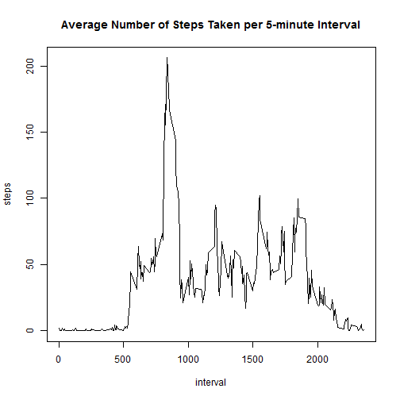
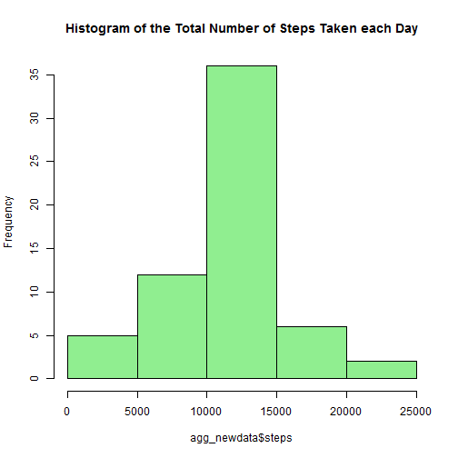
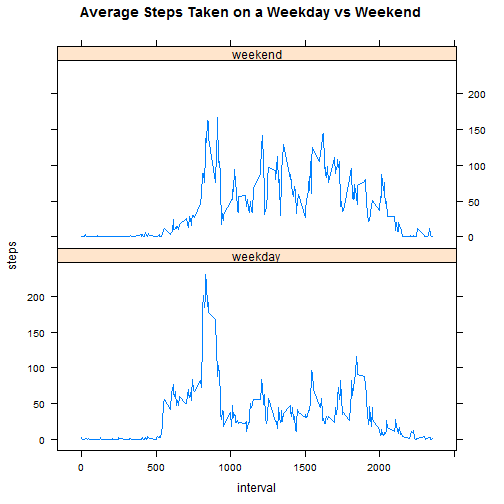

# ANALYSIS

## Loading and preprocessing the data**

```r
#Download, unzip and load the .csv file into an R dataset
temp <- tempfile()
download.file("https://d396qusza40orc.cloudfront.net/repdata%2Fdata%2Factivity.zip",temp)
temp <- unz(temp,"activity.csv")
data <- read.csv(temp)
```

Check the variables available in the dataset.

```r
names(data)
```

```
## [1] "steps"    "date"     "interval"
```

## What is mean total number of steps taken per day?

For this part of the assignment, you can ignore the missing values in the dataset.

1. Calculate the total number of steps taken per day

```r
#Get the sum of steps per day
agg_data<-aggregate(steps ~ date, data, na.rm=TRUE, sum)
```

2. Make a histogram of the total number of steps taken each day

```r
hist(agg_data$steps,main = "Histogram of the Total Number of Steps Taken each Day", col="lightblue")
```



3. Calculate and report the mean and median of the total number of steps taken per day

```r
mean(agg_data$steps)
```

```
## [1] 10766.19
```

```r
median(agg_data$steps)
```

```
## [1] 10765
```

## What is the average daily activity pattern?**

1. Make a time series plot (i.e. type = "l") of the 5-minute interval (x-axis) and the average number of steps taken, averaged across all days (y-axis)

```r
#Get the average of steps per 5-min interval
agg_data2<-aggregate(steps ~ interval, data, na.rm=TRUE, mean)
```


```r
#Plot the average steps per 5-min interval.
plot(steps ~ interval, data=agg_data2, type="l", main="Average Number of Steps Taken per 5-minute Interval")
```



2. Which 5-minute interval, on average across all the days in the dataset, contains the maximum number of steps?

```r
agg_data2[which.max(agg_data2$steps),]$interval
```

```
## [1] 835
```

## Imputing missing values

Note that there are a number of days/intervals where there are missing values (coded as NA). The presence of missing days may introduce bias into some calculations or summaries of the data.

1. Calculate and report the total number of missing values in the dataset (i.e. the total number of rows with NAs)

```r
sum(is.na(data$steps))
```

```
## [1] 2304
```

2. Devise a strategy for filling in all of the missing values in the dataset. The strategy does not need to be sophisticated. For example, you could use the mean/median for that day, or the mean for that 5-minute interval, etc.

```r
library(plyr)    #Needed package for data transformation

#Create a function that will replace missing values with MEAN
impute.mean <- function(x) replace(x, is.na(x), mean(x, na.rm = TRUE))
```

3. Create a new dataset that is equal to the original dataset but with the missing data filled in.

*Use the Mean Steps per Interval, since there are Days with ALL NAs (thus, will just result to NaN imputed Steps)*

```r
#Apply the IMPUTE function on EACH DAY --> to come up with the NEW DATA
data2 <- ddply(data, ~ interval, transform, steps = impute.mean(steps))
```

4. Make a histogram of the total number of steps taken each day and Calculate and report the mean and median total number of steps taken per day. Do these values differ from the estimates from the first part of the assignment? What is the impact of imputing missing data on the estimates of the total daily number of steps?

```r
#Get the sum of steps per day
agg_newdata<-aggregate(steps ~ date, data2, na.rm=TRUE, sum)

#Create a Histogram
hist(agg_newdata$steps,main = "Histogram of the Total Number of Steps Taken each Day", col="lightgreen")
```



```r
mean(agg_newdata$steps)
```

```
## [1] 10766.19
```

```r
median(agg_newdata$steps)
```

```
## [1] 10766.19
```
*There is no difference with the MEAN, and just 1.19 units away from the previous MEDIAN.

## Are there differences in activity patterns between weekdays and weekends?**

For this part the weekdays() function may be of some help here. Use the dataset with the filled-in missing values for this part.

1.Create a new factor variable in the dataset with two levels - "weekday" and "weekend" indicating whether a given date is a weekday or weekend day.

```r
#Make sure that DATE is not a FACTOR Variable --> should be DATE format
data2$date2 <- as.Date(strptime(data2$date, format="%Y-%m-%d"))

#Create a new variable that will tell the DAY of that specific DATE.
data2$day <- weekdays(data2$date2)

#Create a new variable that will classify the DAY as either WEEKEND or WEEKDAY
data2$wkday[data2$day %in% c("Saturday","Sunday")]<-"weekend"
data2$wkday[!(data2$day %in% c("Saturday","Sunday"))]<-"weekday"
```

2. Make a panel plot containing a time series plot (i.e. type = "l") of the 5-minute interval (x-axis) and the average number of steps taken, averaged across all weekday days or weekend days (y-axis). See the README file in the GitHub repository to see an example of what this plot should look like using simulated data.

```r
#Get the MEAN Steps taken per 5-min interval by weekday/weekend
agg_data3<-aggregate(steps ~ interval + wkday, data2, na.rm=TRUE, mean)

library(lattice)   #Needed package for Plotting 'multiple' graphs
xyplot(steps ~ interval|wkday, agg_data3, type="l", layout=c(1,2), main="Average Steps Taken on a Weekday vs Weekend")
```




